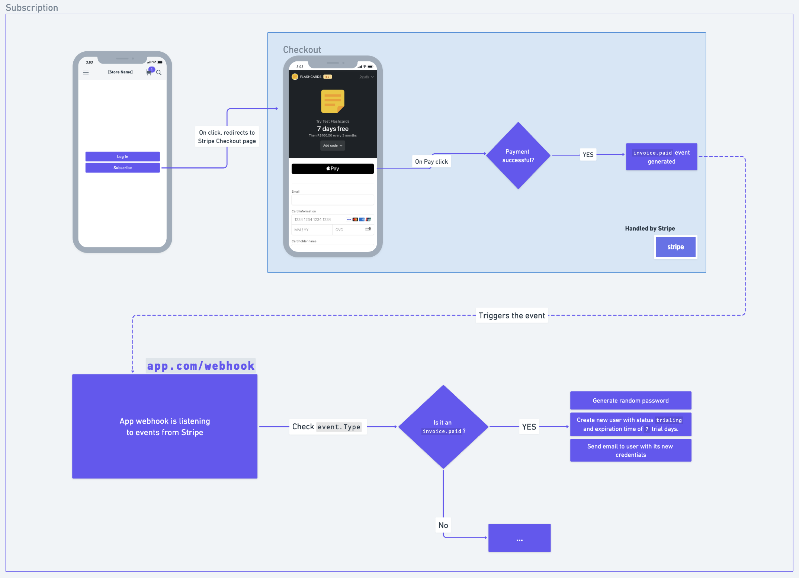

# Integration with Stripe using Go

This is a repository to showcase in a simple and effective manner how to create the integration of the payments platform Stripe with an application written in Go.

## Stripe CLI

[Install Stripe CLI](https://stripe.com/docs/stripe-cli#install):

```sh
brew install stripe/stripe-cli/stripe
```

Then, run:

```sh
stripe login
```

This will redirect you to the Stripe Dashboard in order to allow the access of the CLI to your application.

## Enabling test mode

You can enable test mode on the Stripe Dashboard:


This is good if you don't want to spend real money while testing your application.


## How to run (test mode)

Follow these points:

0) Create an `.env` file:

```sh
cp .env.example .env
```

And then check the [API Keys](#api-keys) and [Webhook Keys](#webhook-key) sections to fill out the environment variables.

1) On a terminal tab, run the server:

```sh
go run .
# > air
```

> Server will be running on port :4444

2) On another tab, let Stripe CLI listen to events and do the redirection to your webhook endpoint:

```sh
stripe listen --forward-to localhost:4444/webhook
```

3) Finally, in another one, trigger an event also using Stripe CLI:

```sh
stripe trigger [event_type]
# > stripe trigger customer.created
```

> [Here](https://stripe.com/docs/api/events/types) you can find a list of all Stripe event types.

3.1) You can also trigger an event by going to your checkout in a human way, i.e., clicking on the checkout link of your checkout page and adding some test data. Testing data example:

Fill out your payment form with test data

- Enter `4242 4242 4242 4242` as the card number
- Enter any future date for card expiry
- Enter any 3-digit number for CVV
- Enter any billing postal code (`90210`)

More testing data can be found [here](https://stripe.com/docs/testing).

## Debugging (test mode)

You don't have to set up breakpoints in your application or logs in order to, for example, check the incoming events and its structure.

When you use the `stripe listen` command, it will print in your terminal the events that it is `post`ing to your webhook. If you click on the name of them, you will be redirected to the `Events` logs in the Stripe dashboard, where can see everything that was received and sent.

## Walkthrough


<p align="center"><i>Subscription model</i></p>


<p align="center"><i>Payment renewal model</i></p>


<p align="center"><i>Flowchart</i></p>

## Misc

### API Keys

The Stripe API keys (public and private) can be found in [here](https://dashboard.stripe.com/test/apikeys), for the test mode, or in [here](https://dashboard.stripe.com/apikeys) for the live mode.

### Webhook key

The webhook key can be found, in test mode, when you run the `stripe listen` command.
For the live mode, you will need to get it at [Developers - Webhook](https://dashboard.stripe.com/test/webhooks).

### Webhooks and subscriptions

When needing to handle subscriptions, [this is the resource](https://stripe.com/docs/billing/subscriptions/webhooks) to follow.

**⚠️ Be aware that some of the configurations are only valid for live mode, not test mode ⚠️**

Here are some insights:

[Successful payments](https://stripe.com/docs/billing/subscriptions/overview#successful-payments):
When your customer successfully pays the invoice, the subscription updates to `active` and the invoice to `paid`. At this point, **you can provision access to your product**.

[Payment window](https://stripe.com/docs/billing/subscriptions/overview#payment-window):
Customers have about `23 hours` to make a successful payment. The subscription remains in status `incomplete` and the invoice is `open` during this time. If your customer pays the invoice, the subscription updates to `active` and the invoice to `paid`. If they don’t make a payment, the subscription updates to `incomplete_expired` and the invoice becomes `void`.
This window exists because your customer usually makes the first payment for a subscription while on-session. **If the customer returns to your application after 23 hours, create a new subscription for them.**

[Failed payments](https://stripe.com/docs/billing/subscriptions/overview#failed-payments):
The subscription’s status remains `active` as long as automatic payments succeed. If automatic payment fails, the subscription updates to `past_due` and Stripe attempts to recover payment based on your [retry rules](https://dashboard.stripe.com/settings/billing/automatic). If payment recovery fails, you can set the subscription status to `canceled`, `unpaid`, or leave it `past_due`.

From [Payment Status](https://stripe.com/docs/billing/subscriptions/overview#payment-status):
| PAYMENT OUTCOME | PAYMENTINTENT STATUS | INVOICE STATUS | SUBSCRIPTION STATUS |
| --------------- | -------------------- | --------------- | -------------------- |
|     Success     |     `succeeded`        |    `paid`        |     `active`    |
| Fails because of a card error | `requires_payment_method` | `open` |  `incomplete`  |
| Fails because of authentication |  `requires_action` |  `open` | `incomplete` |

More subscriptions configurations can be found [here](https://dashboard.stripe.com/settings/billing/automatic).

## Questions

🙋🏻‍♂️ *What happens when the webhook tries to contact the endpoint but is unsuccessful?
For example when something like "I wanna start my subscription now" and then the customer
pays for it, the stripe webhook will try to contact our application. If the application is not online (or the webhook endpoint is not working), how will the customer
get its data created correctly and sent to him via email, for example?*

👉🏻 A: Stripe has a retry policiy to try a few times in a couple of hours, but you will have to basically do it via dashboard if you want something right away. See [this](https://docs.stripe.com/webhooks#retries).

🙋🏻‍♂️ *What happens when customer cancels its subscription (therefore changing the status to `canceled`) but then resumes it - only if the cancellation period will arrive after end of current period - (therefore re-changing the status to `active`)?*

👉🏻 A: This will trigger a `customer.subscription.updated` event (when cancelling to the end of period and when renewing it while still hasn't been cancelled yet)

🙋🏻‍♂️ *What happens when the customer chooses to pause its subscription (the status remains as active)?*

👉🏻 A: This will trigger `customer.subscription.updated`, where `pause_collection` will be:

```json
  "pause_collection": {
      "behavior": "void",
      "resumes_at": null
  }
```

🙋🏻‍♂️ *What event does `resume` trigger?*

👉🏻 A: `customer.subscription.updated` with `"pause_collection": null`

🙋🏻‍♂️ *Questions*: if my renewal date was in 1 week and I decided to pause it now:
  
- *Will I be able to continue using a 3rd party application until the end of the current subscription?*
  👉🏻 Yes, if you depend only on the expire date, then it won't change until the end of the current subscription period.

- *When I unpause it in 2 weeks, will I be immediately charged?*
  👉🏻 You will be charged by how much you've used (this is called `prorate`). This can be change on the Dashboard, under the subscription settings (`https://dashboard.stripe.com/test/subscriptions/{subs_id}?edit={subs_id}`).

- *What will happen if the next billing cycle happens and my account is still paused?*
  👉🏻 If a subscription was paused and then the next billing cycle happens, it will trigger an event `invoice.voided`, setting the status of the invoice to `"status": "void"`. Remember that when you come back and unpause it, it will incur costs of how long on the billing cycle you are (prorate).

### About payments that fail

🙋🏻‍♂️ *What happens when the user payment does not execute correctly for some time and then the user changes the payment method to a valid one for the next cycle, for example?*

👉🏻 A: When the payment does not execute correctly, it will retry based on the [Smart Retries](https://dashboard.stripe.com/settings/billing/automatic) options. If, after all, it does not succeed, then the subscription status will change from `active` -> `past_due` -> `unpaid` and it won't retry again.

Then, after the next billing cycle comes, a `draft` invoice will be generated, but it won't collect automatically because it was created by an `unpaid` subscription.

There is a problem. If, let's say, in a billing cycle of 3 months and the application that is using Stripe only allows its use of the subscription has not expired, this is what is going to happen:

- user paid the first 3 months: `jan, feb, mar` and then can use the external platform until the end of current billing cycle (end of march);
- Stripe tries to pay for the next billing cycle on the beginning of april. The payment and all retries are unsuccessful, therefore the subscription status is `unpaid` - and expired - and the invoice is `overdue`;
- next billing cycle then comes (`jul, aug, sep`) and user hasn't paid the previous one yet (**and also cannot use the external platform because the expiration date is already not valid**);
- an invoice is created in `draft` state and the automatic collection is not activated because it was created by an `unpaid` subscription;
- if the user goes to the `Customer portal` to pay the invoice, there will only be the invoice from `apr, may, jun`, which was `overdue`. But then, during that time, the user could not user some 3rd party application because the subscriptions was expired, but the user would have to pay for that unused time and, in order to use it for the current cycle (`jul, aug, sep`), the user has to pay yet another invoice.

✅ A way to fix this in a quick and effective way is, if all retries for a payment fail, choose to `Cancel` the subscription and mark the invoice as `uncollectible`. By doing this, there will be no problems regarding user *re-engaging* with the subscription. If the user wants to use the 3rd party application again, they will have to create a brand new subscription.
